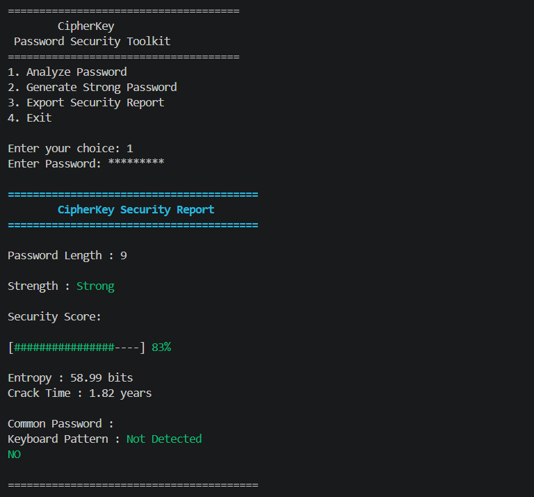

# 🔐 CipherKey v2.0

## Password Security Analysis & Strong Password Generator

CipherKey is a cybersecurity-focused password auditing tool developed in **C programming language**. It analyzes password security using multiple security metrics and provides recommendations to create stronger passwords.

The project demonstrates concepts such as password security, entropy calculation, brute-force estimation, file handling, modular programming, and secure coding practices.

---

# 🚀 Features

## 🔍 Password Security Analysis

CipherKey performs a complete security analysis:

- Password strength evaluation
- Length analysis
- Uppercase/lowercase detection
- Number detection
- Special character detection
- Security score calculation

Example:

Password Strength : Very Strong

Security Score:

[####################] 100%

---

# 🔑 Strong Password Generator

Generates secure random passwords based on:

- Uppercase letters
- Lowercase letters
- Numbers
- Symbols
- Custom password length

Example:

Generated Password:

X7@kP92#mQ!

---

# 📊 Password Entropy Calculation

CipherKey calculates password entropy to estimate randomness.

Example:

Entropy : 85.42 bits

Rating : Excellent

Entropy is calculated based on:

- Character pool size
- Password length
- Possible combinations

---

# ⏳ Crack Time Estimation

Estimates the approximate time required for a brute-force attack.

Example:

Estimated Crack Time:

12000 years

Risk Level: LOW

---

# 🚨 Common Password Detection

Detects passwords commonly used by attackers.

Example:

Password:
password123

Warning:
This password exists in the common password database.

Uses:

common_passwords.txt

for dictionary-based checking.

---

# ⌨️ Keyboard Pattern Detection

Detects predictable keyboard patterns:

Examples:

qwerty
asdfgh
123456
abcdef

Example:

Keyboard Pattern:

DETECTED

---

# 🔒 Hidden Password Input

Passwords are hidden during typing.

Example:

Enter Password:

The password is not displayed on the terminal.

---

# 📄 Security Report Export

CipherKey can generate a detailed report:

CipherKey_Report.txt

Example:

========================================
CipherKey Security Report

Password Length : 16

Strength : Very Strong

Entropy : 98.54 bits

Crack Time : 5000 years

Common Password : NO

Keyboard Pattern: NOT DETECTED

Security Score : 100%

========================================

---

# 🛠️ Technologies Used

| Technology | Purpose |
|---|---|
| C Language | Core development |
| GCC Compiler | Compilation |
| File Handling | Report generation & password database |
| Structures | Data management |
| Modular Programming | Project architecture |

---

# 📂 Project Structure

CipherKey/

│
├── src/
│
├── main.c
│
├── password_report.h
│
├── password_checker.c
├── password_checker.h
│
├── password_generator.c
├── password_generator.h
│
├── entropy_calculator.c
├── entropy_calculator.h
│
├── crack_time_estimator.c
├── crack_time_estimator.h
│
├── common_password_checker.c
├── common_password_checker.h
│
├── keyboard_pattern_checker.c
├── keyboard_pattern_checker.h
│
├── strength_meter.c
├── strength_meter.h
│
├── password_input.c
├── password_input.h
│
├── report_exporter.c
├── report_exporter.h
│
└── common_passwords.txt

---

# ⚙️ Installation & Usage

## 1. Clone Repository

git clone https://github.com/CipherKEY---Password-Security-Analysis-Strong-Password-Generator.git

## 2. Navigate to Source Folder
cd CipherKey/src

## 3. Compile
gcc main.c password_checker.c password_generator.c entropy_calculator.c crack_time_estimator.c common_password_checker.c password_analyzer.c password_input.c keyboard_pattern_checker.c strength_meter.c report_exporter.c -o CipherKey -lm

## 4. Run

Windows:  CipherKey.exe

Linux:  ./CipherKey

🖥️ Demo

Example:

# 🔐 Security Concepts Demonstrated

This project covers:

- Password security principles
- Brute-force attack estimation
- Dictionary attacks
- Password entropy
- Secure password generation
- Input validation
- Security scoring
- File-based security rules

# 🎯 Future Improvements

Planned features:

 - Password breach checking using APIs
 - GUI version using C graphics library
 - Cross-platform password masking
 - Advanced password policy rules
 - Hash strength analysis
 - Multi-language support

 
# 👨💻 Author

Chethana Navin Disanayaka

Cyber Security Undergraduate

Sri Lanka Institute of Information Technology (SLIIT)

# 📌 Disclaimer

CipherKey is an educational cybersecurity project created for learning purposes.

It does not replace professional password auditing tools.

Always follow responsible security practices.

# ⭐ If you find this project useful, consider giving it a star!
